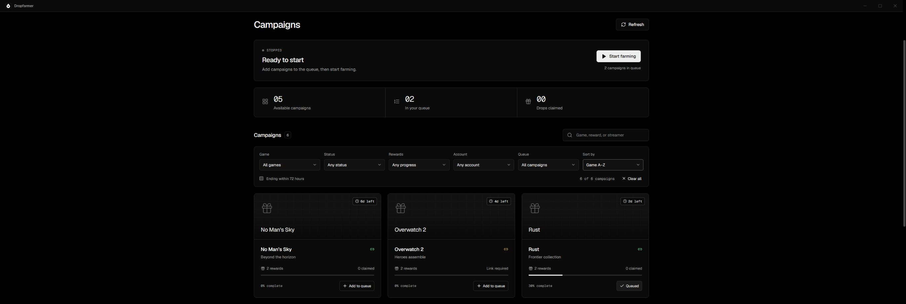

# Dropfarmer

A desktop app for queuing Twitch Drops campaigns and tracking reward progress. Built with Svelte 5, Tauri 2, and Rust. Supports one Twitch account at a time.

<p align="center">
  
</p>

- Sign in through a browser or an activation code.
- Search campaigns by game, reward, or streamer.
- Combine game, status, reward progress, account, and queue filters; sort by deadline, start date, game, or progress.
- Reorder the queue and skip campaigns that cannot currently earn progress.
- Claim completed rewards automatically or from Inventory.
- Load saved campaigns while fresh data loads in the background.
- Check for app updates and install them from Settings.
- Keep farming in the system tray, see why each queued campaign is waiting, and choose desktop notifications.
- Put the PC to sleep after a finished queue, with time to cancel.

The Rust backend sends watch telemetry without downloading video. Progress shown in the app comes from Twitch. This is an unofficial integration and can break when Twitch changes its endpoints.

## Run locally

The current desktop setup targets Windows.

Install:

- [Bun](https://bun.sh/) — the project uses version 1.3.3.
- Node.js 22.12 or newer for the frontend tools.
- Rust through [rustup](https://rustup.rs/).
- Visual Studio C++ Build Tools and Microsoft Edge WebView2. See [Tauri's Windows prerequisites](https://v2.tauri.app/start/prerequisites/#windows).
- Chrome or Edge if you want browser sign-in.

Then run:

```powershell
bun install --frozen-lockfile
bun run tauri dev
```

Tauri starts the frontend server on port `1420`. If that port is already in use, stop the other development server before starting Tauri.

For a browser-only UI preview:

```powershell
bun run dev
```

Open `http://127.0.0.1:1420` and choose **Preview** to use sample data. Sign-in and farming require the desktop app. Run either the preview or Tauri, not both on the same port.

## Use

1. Select **Connect Twitch** and choose a sign-in method.
2. Link your game account through [Twitch's campaigns page](https://www.twitch.tv/drops/campaigns), then refresh the app.
3. Add campaigns to **My queue**. Use the arrows to set their order.
4. Select **Start farming**.

The app checks queued campaigns for an eligible live channel and refreshes progress roughly once a minute. Unlinked accounts, offline channels, future campaigns, and unmet reward prerequisites are skipped so later entries can run. Completed campaigns leave the queue automatically.

Automatic claiming is enabled by default. Turn it off in **Settings** to claim rewards manually from **Inventory**.

Closing or minimizing the window shows a desktop notice and hides it in the system tray while farming continues. Click the tray icon to reopen it, or right-click for **Show Dropfarmer**, **Pause/Resume farming**, and **Quit Dropfarmer**. Turn off **Settings → Minimize to tray** to use normal minimize and close behavior. Quitting stops farming. The queue is restored on the next launch, but stays paused until you start it. There is no automatic startup.

Each queue entry shows its current state: checking Twitch, farming on a channel, waiting behind earlier campaigns, no eligible channel live, account linking, upcoming or ended rewards, unclaimed prerequisites, missing campaign data, or a required reconnect. Retry times are shown after a failed channel check or temporary connection error.

In **Settings → Desktop notifications**, choose alerts for confirmed drop claims, a finished farming queue, or Twitch needing a new sign-in. Notifications are off by default and work while the window is hidden. Use **Test notification** to check delivery. On Windows, use an installed build for the app's notification name and icon; development builds may appear as PowerShell. Windows notification settings and Do Not Disturb can suppress alerts.

**Sleep PC when queue finishes** is available in **My queue** and **Settings** on Windows. It applies to the current run only. After Twitch confirms every queued reward is claimed, the app opens a 60-second countdown. Use **Cancel sleep** in the app or **Cancel sleep when finished** in the tray menu to keep the PC awake. Pausing, adding or removing campaigns, signing out, reconnecting, or restarting turns it off; reordering keeps it enabled. Waiting campaigns and temporary errors do not count as completion. Manually clearing the queue never triggers sleep. Progress is saved before sleep; a save failure cancels it. Turn this option off before installing an app update.

### Sign-in methods

**Browser:** opens a separate Chrome or Edge profile. Complete Twitch's login and leave the campaigns page open until the app finishes connecting. The app checks campaign access before saving the session, then closes its browser and removes the temporary profile. It does not use your everyday browser profile.

**Code:** displays a code to approve on Twitch's activation page. This login may only return campaigns already in progress. If a campaign is missing, try browser sign-in.

Switch methods in **Settings → Twitch connection → Change sign-in**. A failed or cancelled attempt keeps your existing saved login.

Browser sessions expire and currently need another sign-in; automatic renewal is not implemented. Search only filters the campaigns Twitch has returned.

## Build

For a local build without update signing:

```powershell
bun run tauri build --config '{"bundle":{"createUpdaterArtifacts":false}}'
```

Windows outputs:

```text
src-tauri/target/release/dropfarmer.exe
src-tauri/target/release/bundle/nsis/Dropfarmer_<version>_x64-setup.exe
```

## Updates and releases

Install the latest Windows setup file from [Releases](https://github.com/steele123/dropfarmer/releases). Version 0.1.3 is the first build with update support; older builds need a manual install once.

The app checks for updates when it opens. You can also check in **Settings → App updates**. Downloads are verified with the release signing key. Installing pauses farming and restarts the app; your login, queue, and campaign cache stay in place. Farming stays paused after the restart.

### Publish a release

The normal release path runs on this PC, so it uses your local Rust and Bun caches instead of waiting for a hosted runner. Commit your feature work first, then set the next version and publish it in one command:

```powershell
bun run release:publish 0.1.6 --notes-file release-notes.md
```

The script checks the frontend and Rust tests, builds a signed Windows x64 NSIS installer, creates `latest.json`, pushes `main` and the matching tag, uploads the installer, signature, and updater manifest, and publishes the release. If it stops after a network failure, run the same command again; an existing draft is reused. It refuses to overwrite a published version.

Set `TAURI_SIGNING_PRIVATE_KEY` to the signing key file path and optionally set `TAURI_SIGNING_PRIVATE_KEY_PASSWORD` before running it. You also need an authenticated `gh` CLI. Keep the key outside the repository.

The [Release workflow](https://github.com/steele123/dropfarmer/actions/workflows/release.yml) remains available as a manual fallback. It no longer runs automatically when a release tag is pushed, which prevents duplicate releases.

### Signing

The repository secret `TAURI_SIGNING_PRIVATE_KEY` contains the updater's private key. `TAURI_SIGNING_PRIVATE_KEY_PASSWORD` is optional and is only needed for a password-protected key. The public key is in `src-tauri/tauri.conf.json`.

Keep a backup of the private key outside Git. Losing it prevents existing installations from accepting future updates. Do not regenerate it for each release. These signatures verify app updates; they are separate from Windows Authenticode certificates.

For a signed local build, set `TAURI_SIGNING_PRIVATE_KEY` to the key file's absolute path, then run `bun run tauri build`.

## Development

```powershell
bun run check
bun run test
cargo test --manifest-path src-tauri/Cargo.toml
```

Use `bun run test`, which runs Vitest. `bun test` is a different test runner. Keep both `bun.lock` and `src-tauri/Cargo.lock` committed.

Tests that contact Twitch or open a browser are ignored by default. Run a specific one with:

```powershell
cargo test --manifest-path src-tauri/Cargo.toml live_browser_launch_and_cleanup -- --ignored
```

That test opens a blank browser and checks cleanup. The authenticated discovery and queue-refresh tests use the app's saved session; they do not send watch events or claim rewards.

| File                              | Purpose                                               |
| --------------------------------- | ----------------------------------------------------- |
| `src/App.svelte`                  | Campaigns, queue, inventory, settings, and sign-in UI |
| `src/lib/TitleBar.svelte`         | Custom window controls                                |
| `src-tauri/src/engine.rs`         | Farming worker, queue, and saved session handling     |
| `src-tauri/src/twitch.rs`         | Twitch requests and campaign discovery                |
| `src-tauri/src/browser_login.rs`  | Browser sign-in and session capture                   |
| `src-tauri/src/campaign_cache.rs` | Local campaign cache                                  |
| `src-tauri/src/model.rs`          | Campaign data and reward eligibility                  |

The app runs its own Rust backend. It does not launch Python or another miner.

Edit `public/dropfarmer.svg` to change the app icon, then run `bun run icons` to regenerate the native assets.

## Local data

Login credentials are stored in Windows Credential Manager. Queue preferences and campaign data are stored in:

```text
%APPDATA%/app.dropfarmer.desktop/
  preferences.json
  campaigns.json
```

The campaign cache is scoped to the account and sign-in method. After session validation, saved campaigns appear while the app refreshes them. Failed refreshes leave the previous list available. Caches older than seven days are ignored, and farming and claiming still check fresh Twitch data before acting.

The activity log is kept in memory. Credentials are not written to the campaign cache or preferences file.

## Credits

Parts of the Twitch protocol integration are adapted from [DevilXD/TwitchDropsMiner](https://github.com/DevilXD/TwitchDropsMiner) and [rangermix/TwitchDropsMiner](https://github.com/rangermix/TwitchDropsMiner), both under the MIT license.

The UI uses Geist, Geist Mono, and Lucide icons. Source revisions and third-party licenses are in [THIRD_PARTY_NOTICES.md](THIRD_PARTY_NOTICES.md).
